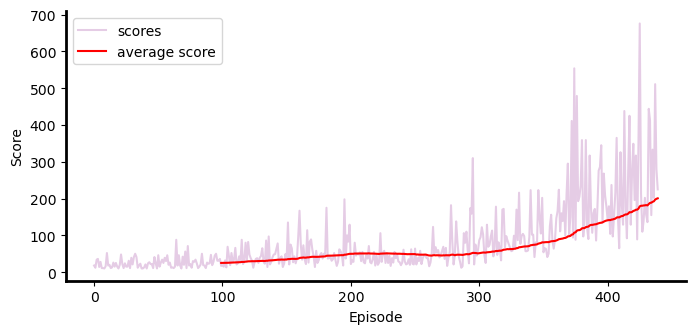

# Solving CartPole Problem using REINFORCE Algorithm


### Introduction
In this project we use policy-based reinforcement learning methods to solve the cartpole problem. The goal is to keep the cartpole balanced. At any time, we can move the cartpole to the left or right. The state space has 4 dimensions:

* position of cart 
* velocity of cart 
* angle of pole 
* rotation rate of pole.

### Method
To train the agent, a gradient-based algorithm called REINFORCE is used.

### Installation
please use the following code to install the packages needed:

```
pip install --upgrade pip
pip install -r requirements.txt
```

### Training Agent
To train an agent to keep the cartpole in balance, please follow the 
instructions in `Navigation.ipynb`.

### Results
The scores for training the agent is shown below:



